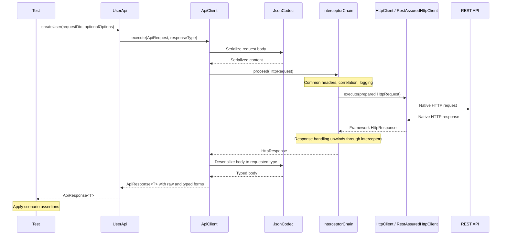

# API Automation Framework — Intent, Architecture, and Design Handoff

Status: agreed architectural direction and latest implementation proposal; repository implementation not verified.  
Updated: 2026-09-16  
Source: [API Testing Server Options — shared conversation](https://chatgpt.com/share/6aa80f64-2308-83e8-9c39-abcce6816308)

This revision replaces the earlier document based on a truncated preview. The public conversation supplied the opening intent, framework requirements, architectural debates, accepted request/response direction, and complete final class/interface proposal. Service setup and troubleshooting are intentionally excluded.

## 1. Conversation intent and working agreement

### What the user is trying to achieve

Build an extensible API automation framework and understand why its architecture is designed that way. The user is already experienced in REST API testing; this is not a beginner exercise in HTTP methods or writing isolated REST Assured tests. The conversation focuses on responsibility boundaries, reusable capabilities, replaceable implementations, and the tradeoffs behind each choice.

The service under test exists to provide a controllable, sufficiently capable environment for exercising the framework. The user wanted to avoid spending substantial time building Spring Boot services and accepted FastAPI as a practical option. The initial rejection of a staged server tutorial meant the service should expose useful behavior from the outset. It does not conflict with the later agreement to implement the framework incrementally.

The framework's intended users are test authors. They should express application actions, supply varied test data and request options, inspect results, and choose their own assertions. Normal tests should not repeatedly manage tokens, construct library-specific requests, or coordinate logging and reporting infrastructure.

### How the design work should proceed

The user explicitly requested reasoning behind almost every decision, one part at a time, and invited challenges to their ideas. The agreed working approach is to:

1. Identify the problem and the responsibility that needs a home.
2. Explain plausible designs, their tradeoffs, and the recommended choice.
3. Explain what that choice constrains later and distinguish agreement from a proposal.
4. Design enough to implement the next complete slice.
5. Inspect the implementation, learn from it, and return to architecture for the next capability.

User preference reinforced on 2026-09-16: maintain independent technical judgment. Do not change a recommendation simply because the user asks a question or proposes an alternative. Compare the choices, explain concrete advantages and costs, and recommend the better fit for this framework. Revise a position only when reasoning, evidence, or changed requirements justify it, and explain that reason. A question does not imply acceptance of an alternative. This preference is also recorded in `AGENTS.md` as persistent project memory.

Early requests to stay at architecture/features level were followed by agreement to start a vertical slice and then a request to discuss classes/interfaces. Preserve that progression: do not restart an exhaustive design phase or generate the entire future framework at once. The final outstanding design step was to settle the exact boundaries and fields of the four central request/response models before implementing the slice.

### Full target versus first increment

The user explicitly identified authentication, request specification, serialization, correlation IDs, common headers, error normalization, request/response logging, reporting attachments, retries, and response processing as required framework capabilities. Those requirements justified retaining `ApiClient` as a real orchestration layer.

The user subsequently accepted proving a smaller execution path first. Full token refresh, retry policies, reporting integration, contract validation, external integrations, DI, asynchronous HTTP, and UI are therefore outside the first increment, while remaining part of the target or future design work. Incremental delivery must not erase the broader requirements.

### How to use this handoff

The architecture document records how the framework should be organized and why. The API collection records what the application exposes. Use the collection and repository to establish actual paths, schemas, authentication requirements, and project conventions. Example user fields such as roles and preferences were explicitly hypothetical and must not be implemented merely because they appeared in discussion.

Intent is synthesized from the user's opening requests and prompts 10–19; the final repository handoff request is prompt 22 in the [shared conversation](https://chatgpt.com/share/6aa80f64-2308-83e8-9c39-abcce6816308).

## 2. Decision status

| Status | Meaning |
| --- | --- |
| **Locked direction** | Explicit user choices or architectural recommendations accepted in the conversation. Preserve unless deliberately revisited. It does not mean implemented. |
| **Latest class/slice proposal** | The complete final assistant design, presented after the user accepted the conceptual flow. Use it as the next implementation baseline to review; do not claim every signature received separate approval. |
| **Deferred implementation** | A required or intended capability whose implementation is outside the first increment. |
| **Open decision** | Alternatives, policies, or exact contracts were discussed but not settled. |
| **Architectural principle** | A responsibility boundary or rationale to preserve while filling in details. |

The final class proposal and unresolved contracts appear separately below. Later refinements supersede earlier diagrams: for example, the final proposal uses `HttpClient` as the HTTP port instead of keeping both `HttpClient` and `HttpPort`.

### Accepted refinement — 2026-09-16

`ApiRequest` is non-generic and describes only the outgoing operation: method, path, body, and options. The response-mapping instruction is supplied separately to `ApiClient.execute(request, responseType)`. `UserApi` selects that response type; normal tests continue to call application operations without supplying mapping details.

For simple DTO responses, the agreed signature is `<R> ApiResponse<R> execute(ApiRequest request, Class<R> responseType)`. The response type argument ties the returned `ApiResponse<R>` to the supplied runtime type. A framework-owned descriptor for parameterized response types remains open.

Reason: placing a response type argument on `ApiRequest<T>` was misleading to readers; renaming `T` to `R` did not resolve the responsibility confusion. This explicitly supersedes the original generic request proposal. Exact field representations and construction details remain to be settled as needed for the first slice.

## 3. Locked decisions and selected foundations

### 3.1 Scope and technology direction

| Area | Decision or selected direction | Remaining detail |
| --- | --- | --- |
| Current scope | API automation first; UI automation is phase two. | UI technology and integration design are deferred. |
| Language direction | Java-based framework using POJOs and the selected Java ecosystem. | Java and dependency versions are not fixed by this record. |
| Build | Gradle, intentionally chosen as a learning opportunity. | Build scripts, tasks, modules, and package structure remain to be designed. |
| Test execution | TestNG, including parallel execution, listeners, parameterization, DataProviders, factories, and test retry capabilities. | Exact listeners, scopes, scheduling, and retry policies are deferred. |
| HTTP implementation | REST Assured initially, behind a replaceable framework HTTP contract. | Alternative adapter implementation and selection mechanism are deferred. |
| JSON mapping | Jackson with POJO request/response models, encapsulated behind a framework boundary. | Final proposal names that boundary `JsonCodec`. |
| Logging | Logback with configurable levels; AspectJ was also requested. | The initial HTTP execution mechanism is the interceptor chain. Detailed AOP use is not finalized. |
| Configuration | Environment switching, environment-dependent test selection, and framework feature flags, including contract validation. | Loading, precedence, and selection mechanisms need detailed design. |

Reporting is required, but Allure versus Extent was not finally settled: the assistant recommended Allure. Hamcrest was the user's stated assertion preference; the assistant suggested considering AssertJ, explicitly leaving that comparison for later. Spring was raised as a possible DI solution, not selected as a mandatory dependency.

### 3.2 Preserve three distinct execution responsibilities

The user explicitly locked this direction after challenging whether `ApiClient` was necessary:

```text
Test → API Object Model → ApiClient → HTTP boundary → transport adapter
```

- **API Object Model:** describes application operations in terms useful to tests. `UserApi` knows the operation's method, path, request type, response type, and operation-specific details. It is more than a passive registry.
- **ApiClient:** orchestrates shared API execution capabilities and prepares/handles framework request and response models. It delegates the capabilities instead of implementing all of them itself.
- **HTTP boundary and adapter:** execute a prepared HTTP request and convert between framework-owned and library-specific representations.

`ApiClient` is justified by present shared responsibilities. Supporting hypothetical future protocols is not its sole justification.

### 3.3 Use a lightweight interceptor chain

The accepted direction is a small interceptor chain for behavior around execution: authentication, correlation, common headers, logging, reporting, and retry policy as those capabilities are added.

`ApiClient` remains responsible for orchestration and request preparation, including coordinating serialization. Do not turn every operation into an interceptor simply because the mechanism exists. The sequence and retry/authentication interactions still require detailed design.

### 3.4 Keep technology-specific objects inside adapters

Only the REST Assured adapter should depend on REST Assured request/response types. It translates a framework `HttpRequest` into a native request and the native response into a framework `HttpResponse`.

The adapter does not deserialize into application/business DTOs. `UserApi`, `ApiClient`, tests, and authentication infrastructure should not depend on `io.restassured.*`. The same boundary principle applies to Jackson, reporting libraries, and future external integrations.

### 3.5 Use DTOs normally; preserve a raw-payload escape hatch

The accepted request-body strategy is:

```text
Normal:      constructed DTO → UserApi → ApiClient
Data files:  loader → DTO → UserApi                         [later]
Exceptional: deliberately raw payload → raw execution path [API shape open]
```

Different DTO instances represent different valid or expressible invalid scenarios. The ordinary `createUser` contract should not grow equivalent DTO, file, JSON-string, and map overloads.

Raw JSON support is an accepted capability for cases a DTO cannot express, including malformed payloads and wrong field types. Its exact entry point, such as an operation-specific raw method or a generic execution facility, remains open. JSON-file loading belongs in later data management. Map-based input is not a default requirement.

### 3.6 Tests own expectations; execution returns evidence

Scenario assertions belong in tests or test-invoked helpers. Do not pass expected statuses, JSON values, database outcomes, or other scenario expectations through `UserApi` and the execution pipeline.

The intended structure is arrange data, execute the operation, receive a response, then assert. JSON, schema, database, and messaging validators can be available to the test layer as those capabilities are implemented.

A globally configured framework invariant, such as validating applicable responses against a contract, may be implemented as pipeline policy. That exception does not move ordinary test assertions into interceptors.

### 3.7 Separate adaptation, mapping, querying, and validation

| Responsibility | Agreed home/direction |
| --- | --- |
| Native response adaptation | REST Assured adapter produces neutral `HttpResponse`. |
| JSON serialization and typed deserialization | Current REST `ApiClient` orchestrates a mapping abstraction; the final proposal uses `JsonCodec`. |
| JSONPath inspection | Separate JSON-specific query/validation helper, rather than `HttpResponse.jsonPath(...)`. |
| Scenario validation | Test/assertion layer after execution. |

Preserve both the raw framework response and the typed body in the test-facing result, proposed as `ApiResponse<T>`. Typed mapping must not discard status, headers, raw content, or timing information.

The response model is HTTP/library-neutral, not exclusively JSON. XML, text, binary, empty, or malformed content should not be conceptually ruled out. Exact storage and mapping-failure behavior remain open.

### 3.8 Keep test state isolated and correlation consistent

The agreed concept is a test-scoped `TestContext` for state shared by steps within one test execution; its concrete class shape is part of the final proposal. Correlation state belongs there, not in a global map or mutable shared `ApiClient` field.

Generate and store a correlation ID when needed, then reuse it for subsequent calls within the same test flow. Different test executions have isolated contexts, including during parallel execution. Context creation, injection/access, cleanup, and caller-supplied correlation-ID precedence remain detailed design work.

### 3.9 Respect deliberate request overrides

Explicit request values taking precedence over defaults is the locked direction. The broader proposed merge order is framework defaults, environment defaults, API defaults, then request-specific values. A common-header component should normally fill missing values rather than overwrite deliberate test inputs.

This establishes request-default precedence; it does not settle the complete configuration-source hierarchy or every special header/authentication policy.

### 3.10 Keep authentication infrastructure out of ordinary tests

Normal operation calls should not require test authors to obtain and pass tokens repeatedly. Authentication infrastructure selects the mechanism and handles token availability/renewal. Tests specifically exercising authentication are a separate use case.

Token refresh/replay, general HTTP retries, whole-test retries, and polling are distinct concerns. Their policies and interactions must be designed explicitly rather than hidden inside the REST Assured adapter.

### 3.11 Extend by capability without flattening protocols

Future SOAP, GraphQL, and gRPC support should preserve their semantics. The accepted REST design does not require one universal client or JSON serializer for every protocol. Common capabilities may be reused where appropriate.

Asynchronous HTTP and asynchronous messaging are also different: Kafka support is not itself a reason to choose an asynchronous HTTP client. Database, messaging, cache, cloud, and filesystem support should have clear integration boundaries.

These decisions are grounded in prompts 11–20 and the acceptance in prompt 21 of the [shared conversation](https://chatgpt.com/share/6aa80f64-2308-83e8-9c39-abcce6816308).

## 4. Architectural principles to preserve

- **Tests express intent; framework components provide capabilities; adapters contain technology details.** Test methods should read as application operations and verification steps.
- **Give each abstraction a present responsibility.** The framework should not copy a vendor API wholesale or introduce an interface for every concrete class.
- **Compose shared behavior.** Keep both `ApiClient` and `HttpClient` focused; the client orchestrates, interceptors participate in execution, and transport sends HTTP.
- **Distinguish operation intent from a prepared request.** An application DTO, `ApiRequest`, and `HttpRequest` solve different problems.
- **Preserve observable results.** Mapping and normalization should retain the raw response needed for diagnostics and negative tests. Exact failure policies are still open.
- **Separate execution from assertions.** Framework policy and test-specific expectations have different owners.
- **Design lifecycle and isolation deliberately.** Parallel execution affects contexts, data ownership, authentication state, dependencies, and cleanup.
- **Keep infrastructure organized by capability.** Database, Kafka, Redis, S3, and filesystem integrations should not become one miscellaneous utilities container. Keep any `BaseTest` thin and put reusable behavior in focused components.
- **Let lifecycle needs guide DI.** A per-test state container is not, by itself, a reason to introduce Spring.
- **Build one complete path, then extend it.** Design one step ahead of implementation and use working code to evaluate the abstractions.

These principles summarize the discussion's reasoning. They do not authorize extra modules beyond the current increment.

## 5. First vertical slice — latest proposal

### Objective and scope

Execute one POST create-user operation end to end through the framework, return both raw and typed response information, and let the test assert its expectations. Actual operation details come from the API collection.

The final proposal starts with common-header, correlation-ID, and logging interceptors. Authentication follows after the basic chain is proven; full reporting and retries follow later. If the chosen operation requires authentication, provide only the prerequisite needed to exercise it rather than assuming it is public.

The last assistant response supplied the following class design. The user then requested the Markdown handoff. Therefore, the class design is available in full, but its exact contracts should not be described as individually approved implementation specifications.

### Proposed execution flow



Plain-text summary:

```text
Test → UserApi → ApiRequest + responseType → ApiClient
     → JsonCodec + framework HttpRequest
     → interceptor chain → HttpClient → REST Assured adapter → service
     ← ApiResponse<T> ← typed mapping + raw HttpResponse ← adapter
Test → assertions / validation helpers
```

The sequence shows the proposed simple JSON path. It is not a finalized policy for malformed responses, empty bodies, non-JSON content, retries, or asynchronous execution.

### Proposed classes and interfaces

| Component | Type | Responsibility |
| --- | --- | --- |
| `CreateUserTest` | Test class | Construct data, invoke the operation, and assert expectations. |
| `CreateUserRequest`, `CreateUserResponse` | DTO/data classes | Carry actual application request and response data. |
| `RequestOptions` | Value class | Group optional headers, query parameters, path parameters, and later request settings. |
| `UserApi` | Concrete class | Describe the operation, build an `ApiRequest`, and supply the response type separately to `ApiClient`. No redundant `DefaultUserApi` abstraction. |
| `ApiRequest` | Value class | Carry method, path, body, and options. Non-generic; excludes the response-mapping instruction (accepted refinement, 2026-09-16). |
| `ApiClient` | Concrete class | Coordinate preparation, codec use, interceptor execution, response processing, and result construction. |
| `JsonCodec` | Interface | Provide JSON serialization and deserialization as one abstraction. |
| `JacksonJsonCodec` | Concrete adapter | Implement `JsonCodec` using Jackson. |
| `HttpRequest` | Value class | Represent the framework HTTP request; preferably immutable with modified copies through processing. |
| `HttpResponse` | Value class | Preserve neutral HTTP results and raw content. |
| `ApiResponse<T>` | Value class | Combine a typed body with its raw framework `HttpResponse`. |
| `HttpClient` | Interface / HTTP port | Execute `HttpRequest` and return `HttpResponse`. |
| `RestAssuredHttpClient` | Concrete adapter | Implement `HttpClient`; contain REST Assured conversions and calls. |
| `HttpInterceptor` | Interface | Participate before and/or after delegated execution. |
| `InterceptorChain` | Interface | Continue execution with a request. |
| `DefaultInterceptorChain` | Concrete class | Advance through interceptors and eventually invoke `HttpClient`. |
| `CommonHeadersInterceptor` | Concrete interceptor | Apply appropriate defaults while respecting overrides. |
| `CorrelationIdInterceptor` | Concrete interceptor | Attach/reuse correlation information from the test context. |
| `LoggingInterceptor` | Concrete interceptor | Observe request/response execution for logging. |
| `TestContext` | Concrete class | Hold a test ID, correlation ID, and later test-scoped state. |

Conceptual signatures, not finalized compilable API definitions:

```text
ApiClient.execute(ApiRequest, Class<R> responseType) -> ApiResponse<R>
HttpClient.execute(HttpRequest) -> HttpResponse
HttpInterceptor.intercept(HttpRequest, InterceptorChain) -> HttpResponse
InterceptorChain.proceed(HttpRequest) -> HttpResponse
JsonCodec.serialize(object) -> serialized JSON
JsonCodec.deserialize(json, targetType) -> typed value
```

The proposed `ApiClient` executes an operation object rather than exposing a second collection of `get/post/put/delete` methods. `HttpClient` itself is the port; do not add `HttpPort` for the same boundary.

### The four central models

The final conversation explicitly identified these as the next contracts to finalize. The following table consolidates the proposal and its responsibility implications; exact field types, constructors, and exclusion rules still need that short design pass.

| Model | Proposed contents | Responsibility boundary |
| --- | --- | --- |
| `ApiRequest` | Method, operation path, request body, `RequestOptions`. | Describes the requested operation before wire preparation; carries no response type, scenario expectations, or native REST Assured spec. |
| `HttpRequest` | Method, URI/path, headers, query/path parameters, serialized body, content type, timeout, metadata. | Contains everything required by the adapter by the time transport executes; uses framework-owned representations. |
| `HttpResponse` | Status, headers, raw body, content type, response time, optional transport metadata. | Represents the HTTP result; does not own business DTO mapping, JSONPath, or scenario assertions. |
| `ApiResponse<T>` | Typed body plus original framework `HttpResponse`. | Provides convenient typed access while retaining the raw result. |

`HttpRequest` immutability/builder details remain open. Binary-capable raw-body storage was recommended to avoid a JSON-only response abstraction; the exact representation is not selected. The target-type mechanism for generic payloads, empty responses, and mapping errors also remains open.

### Request options and specification building

#### Header representation — recommendation under discussion, 2026-09-16

Recommend a small, immutable, framework-owned `HttpHeaders` value class with string header names and ordered values per name. It is not an enum or a catalogue restricting custom headers. An internal `Map<String, List<String>>` is a reasonable storage choice, provided name matching is case-insensitive and values are defensively copied.

The class earns its place by centralizing case-insensitive lookup, explicit replace/add operations, and immutable ownership for consumers in request preparation, interceptors, and adapters. Header default/override policy remains with the relevant preparation component or interceptor; the collection supplies consistent operations. A public map with shared helpers is workable and initially smaller, but every consumer must honor those helper conventions. It is less protective of these invariants as the execution pipeline grows. An enum alone cannot represent arbitrary custom names and values.

Test authors can retain convenient `RequestOptions.builder().header("X-Custom-Header", "value")` input; using a dedicated internal/public value type does not require verbose test code. Map input may be offered as a convenience and copied into the value class. Preserve repeated values and their order without blindly comma-joining them: not every field supports combination. See [RFC 9110, sections 5.1–5.3](https://www.rfc-editor.org/rfc/rfc9110.html#section-5.1).

The earlier conversational switch to a bare map was premature and is superseded by this reasoned recommendation. The user has requested the comparison, not yet accepted a header contract. Exact methods and representation remain proposals; do not implement or mark them locked on that basis.

Normal calls should allow both `createUser(request)` and `createUser(request, options)`. The proposed initial options include headers, query parameters, and path parameters, with an empty/default value. Cookies and additional settings were discussed, but the complete public options contract was not settled.

The final proposal removes the earlier standalone framework `SpecBuilder`: `HttpRequest` already serves as the framework request specification. Construction and policy application still occur; a duplicate representation is unnecessary. Native REST Assured specification construction stays inside the adapter. A mapper/spec factory may be extracted there later if conversion logic becomes substantial.

### Suggested first-slice completion criteria

These are derived handoff checks, not additional historical decisions:

1. Finalize the four model contracts and the minimum dependency/context wiring.
2. Implement one actual operation through the proposed path with the three initial interceptors.
3. Verify request overrides and correlation reuse without shared test state leaking between executions.
4. Return raw response information and the supported typed representation; perform assertions from the test.
5. Keep REST Assured and Jackson types at their designated implementation boundaries.
6. Review whether each component justified its responsibility before adding the next capability.

The class design and first-slice details come from the response to prompt 21 in the [shared conversation](https://chatgpt.com/share/6aa80f64-2308-83e8-9c39-abcce6816308).

## 6. Capability ownership and deferred implementation

The required capability can be settled even when its class name or policy is still open.

| Capability | Intended home | Implementation/status |
| --- | --- | --- |
| Environment/framework configuration | Configuration component, consumed by execution and setup. | Separate environment values from framework feature/execution settings. Detailed loader and source precedence deferred. |
| Request preparation/specification | `ApiClient`, framework request construction, and applicable interceptors. | No separate framework `SpecBuilder` in the latest proposal. |
| Common headers | Request defaults/configuration and `CommonHeadersInterceptor`. | Minimal form belongs in the first slice. |
| Correlation | State in `TestContext`; request attachment in an interceptor. | Minimal form belongs in the first slice; lifecycle details remain open. |
| JSON mapping | `ApiClient` delegates to `JsonCodec` / `JacksonJsonCodec`. | Simple DTO mapping belongs in the first slice; advanced failure/content handling remains open. |
| Authentication | Proposed `AuthInterceptor → AuthManager → AuthProvider`. | `AuthProvider` interface varies strategy; concrete manager coordinates lifecycle. Full auth follows the basic slice. |
| Token management | Authentication infrastructure. | Obtain/cache/refresh as appropriate; sharing, expiry, invalidation, and replay policies need design. |
| Error normalization | Response interpretation after transport; coordinated by the API layer. | Required capability, but no finalized error taxonomy or `ResponseProcessor` contract. Distinguish transport failures from HTTP/API outcomes. |
| Request/response logging | Logging interceptor/integration, with Logback configuration. | Minimal logging first; levels, final formatting, and AspectJ participation remain to be detailed. |
| Reporting attachments | Reporting interceptor/listener and replaceable reporting integration. | Required later; Allure recommended, Extent alternative not formally closed. No `attachToAllure` logic in `ApiClient`. |
| HTTP retry | Execution policy/interceptor. | Deferred; coordinate with authentication refresh. Do not confuse with TestNG whole-test retries. |
| Polling | A distinct eventual-condition capability. | Deferred; not equivalent to retrying a failed test or blindly replaying requests. |
| Contract/schema validation | Test helper or configured framework policy, according to purpose. | Deferred; framework-wide invariants may participate in response processing. |
| Data management | Data creation/loading and lifecycle components. | Builders/factories/loaders, uniqueness, ownership, cleanup, and parameterized data remain to be designed. |
| TestNG lifecycle | Test execution integration and a thin `BaseTest` if used. | Include the minimum per-test context provision and cleanup needed by the slice; defer the broader lifecycle/listener system, factories, and retry rules. |
| Suite selection | TestNG groups plus build/execution configuration. | Smoke, regression, and E2E requested; contract grouping proposed. Reuse tests across groups rather than duplicating them. |
| External systems | Dedicated DB, Kafka, Redis, AWS/S3, and filesystem integrations. | Future implementations, including file upload/download. Do not infer application workflows from this list. |
| Async HTTP | Separate HTTP capability/adapter as needed. | `async-http-client` was named as a candidate; async contracts and scheduling are not finalized. |
| DI | Dependency/lifecycle wiring. | Spring is a candidate, not a prerequisite. Determine scopes first. |
| UI automation | Separate UI area sharing suitable core capabilities. | Explicit phase two; no UI client or browser framework selected. |

Proposed authentication strategies include bearer token, basic, and API-key providers; OAuth2/JWT/custom mechanisms were also discussed. This is a capability roadmap, not a requirement to implement every provider in the initial slice.

## 7. Open decisions

- **Exact request/response contracts:** field types, body representations, generic target types, builders/immutability, metadata, and the boundary between resolved and unresolved URLs/parameters.
- **Mapping and error behavior:** eager versus optional/on-demand typed access where needed; malformed/empty/non-JSON bodies; preserving raw access after mapping failure; transport errors versus HTTP error responses.
- **Interceptor semantics:** final order, registration/configuration, response unwinding, retries/refresh interactions, and how logging/reporting observe repeated attempts.
- **Context and object lifecycle:** TestNG creation/provisioning, scope of clients/managers/configuration, state cleanup, token sharing, and asynchronous context propagation.
- **Raw input API:** operation-specific versus generic escape hatch and its interaction with DTO serialization.
- **Configuration mechanics:** sources, loading, feature flags, environment test selection, and adapter selection through configuration, DI, or a factory/container.
- **Auth/retry policies:** refresh triggers, retry eligibility and limits, and interactions between transport retries, auth replay, polling, and TestNG retries.
- **Assertions and reporting:** JSONPath implementation, assertion helper APIs, Hamcrest/AssertJ choice, Allure/Extent decision, and AOP versus interceptor participation.
- **Project organization:** Gradle scripts/tasks, dependency versions, modules/packages, and detailed resource structure.
- **Future integrations/protocols:** public contracts for async HTTP, messaging, database/cache/cloud integrations, files, SOAP/GraphQL/gRPC, and phase-two UI.

Ownership of REST deserialization, preservation of raw responses, external JSONPath helpers, and raw-input support are no longer unknown: the full conversation resolves their architectural direction. Only their detailed contracts/policies remain open.

## 8. Decision evolution and superseded ideas

| Earlier idea | Final direction recorded here | Reason |
| --- | --- | --- |
| Remove `ApiClient` while only REST exists. | Retain it as shared API execution orchestrator. | The user clarified that cross-cutting capabilities were present requirements, then explicitly locked the layer. |
| Treat the API object as only a registry. | It describes the application operation and maps it to an API request. | Method, path, DTO types, and operation details need a clear owner. |
| Use REST Assured-shaped core APIs/specs. | Use framework-owned models; native conversion belongs in the adapter. | Replacing the library should not require rewriting higher layers. |
| Keep both `HttpClient` and `HttpPort`. | Latest proposal uses `HttpClient` itself as the port. | They duplicated the same boundary. |
| Add framework request/response spec builders immediately. | Latest proposal uses `HttpRequest`; native spec building stays inside the adapter. | Avoid duplicate representations and misplaced assertions. |
| Separate `Serializer` and `Deserializer` interfaces initially. | Latest proposal uses one `JsonCodec` with a Jackson implementation. | Related JSON mapping responsibilities need one small boundary now. |
| Make `ApiClient` a universal REST/GraphQL/gRPC deserializer. | REST-focused orchestration with reusable capabilities and protocol-specific clients later. | Different protocols do not share identical execution/content semantics. |
| Put JSONPath on `HttpResponse`. | Use a separate JSON query/validation helper. | HTTP responses need not be JSON. |
| Use JSON/XML/DB interceptors for scenario assertions. | Test-owned verification after execution. | Keep operation execution independent of each test's expectations. |
| Accept every request-body source through equivalent overloads. | Canonical DTO, later data loaders, explicit raw escape hatch. | Keep service API methods focused while allowing negative testing. |
| Introduce Spring to share a map across steps. | Define `TestContext`, dependencies, and lifecycle first. | Shared test state is a scope problem; the DI technology is a later choice. |
| Fully design every module before starting implementation. | Design the next slice, implement it, and use feedback. | The execution path should test whether the abstractions help. |
| Put the response type on `ApiRequest<T>`. | Non-generic `ApiRequest`; pass the response type separately to `ApiClient.execute`. | Accepted 2026-09-16: a response type argument on a request class confused its meaning; separate mapping instructions preserve readability and return-type safety. |

Earlier flow diagrams were exploratory and sometimes retained names that later changed. Use the final responsibilities and status labels in this document rather than implementing every box that appeared anywhere in the conversation.

## 9. Immediate continuation point

The non-generic `ApiRequest` and separate response-type argument are now accepted. Resume with `HttpRequest`, then `HttpResponse` and `ApiResponse<T>`. Decide exactly what each contains, what stays outside it, and the minimum behavior necessary for the POST slice. Explain the tradeoffs to the user in the same one-part-at-a-time style. Resolve remaining construction and field details for `ApiRequest` when needed.

Then implement the vertical slice using the actual API collection and existing repository conventions. Keep broader capabilities visible in the roadmap, but add them to a functioning execution path incrementally. Record newly accepted decisions and update this handoff when the design changes.

## Accepted transport decision — 2026-09-24

Keep REST Assured behind the framework HttpClient interface. The user clarified that removing
REST Assured was not intended and explicitly accepted the deprecated Apache DefaultHttpClient
usage needed by this custom-client integration. The temporary JDK adapter is superseded and removed.
RestAssuredHttpClient configures DefaultHttpRequestRetryHandler(0, false) to disable retries by
that handler, with deprecated usage isolated and documented inside the adapter.
ApiClientFactory again constructs RestAssuredHttpClient. Request timeout applies separately to
connection establishment and socket-read inactivity; it is not a whole-response deadline.
Source examples remain in the temporary bundle; the user's handwritten project Java files are untouched.
Do not run tests, per the user's instruction.

## Accepted body logging wiring — 2026-09-24

`LoggingInterceptor` optionally consumes `BodyLogFormatter` for both request and response bodies.
Existing constructors leave body logging disabled; framework wiring enables it by supplying a formatter.
Summaries and enabled bodies are logged at INFO. Request URIs include query parameters, and request and
response headers are included by default. Only values with sensitive names are redacted; ordinary query
parameters and headers remain visible. The interceptor checks the dedicated `logging.bodies` logger before
copying or formatting bytes. `JacksonBodyLogFormatter` owns recursive JSON redaction, an exact character cap,
and safe handling of malformed or non-text bodies; the original request/response evidence is unchanged.

The consuming test project provides Logback at runtime and owns `logback-test.xml`. That file selects console
formatting and the INFO level and publishes the default 8,000-character body cap through the validated
`framework.logging.max-body-chars` system property. `logging.bodies` remains the YAML/runtime switch that decides
whether a body formatter is installed. Production defaults to body logging disabled in the sample catalog, but
this is a configurable policy rather than a framework prohibition. Destructive tests remain prohibited in PROD.

## Accepted package organization — 2026-09-25

Reusable code is organized under `framework`: client orchestration/models, neutral HTTP contracts,
the REST Assured adapter, interceptors, serialization, logging, and test context each have a package
matching their responsibility. Service-specific user operations live under `users`, with DTOs in
`users.model`; `CreateUserTest` lives in `src/test/java/users`. This keeps vendor code confined to
`framework.http.restassured` and prevents application operations and DTOs from being mixed with
framework infrastructure. Package grouping stays intentionally coarse enough to avoid one-class packages.

## Accepted Java baseline — 2026-09-25

The project targets Java 17. REST Assured 6 requires Java 17+, and the framework uses Java 17 language
features such as pattern matching for `instanceof`. Gradle declares source/target compatibility and
compiles with `--release 17` so IDE imports and generated bytecode use the same baseline.

## Accepted environment configuration design — 2026-09-26

Configuration is loaded once per TestNG suite into an immutable, typed `FrameworkConfig`; consumers
receive that object rather than reading global configuration themselves. `ConfigLoader` receives the
selected environment explicitly and has no dependency on TestNG, Gradle, or Jenkins.

Local selection comes from a TestNG suite parameter. A Java system property can override that parameter
for CI; Jenkins converts its environment choice into the command-line system property. The environment
name is normalized and validated, the matching file must exist, and no misspelling may silently fall back.
Production is never an implicit environment.

Configuration value precedence, highest first, is: Java system property, OS environment variable,
selected environment file, then default file. Required values, strict types, positive durations, strict
booleans, blank overrides, and unknown framework-owned keys are validated at startup. Configuration is
an immutable snapshot for the complete suite; hot reload is excluded.

The initial proposal used `config/default.properties` plus
`config/environments/{environment}.properties`. The later multi-service requirement reopens the
physical file format and layout while preserving the accepted selection, precedence, validation,
lifecycle, and safety rules.
The initial typed values are environment name, API base URI, default timeout, body-logging flag, and an
allow-destructive-tests policy. QA and INT may allow destructive suites; production permits only explicitly
safe groups, defaults body logging to disabled, and cannot be selected accidentally. Consumers may deliberately
enable redacted production body logging. Secrets do not belong in property
files, TestNG XML, logs, exception messages, or ordinary Jenkins parameters; later secret values come from
credential-backed runtime sources. Startup logs show a redacted effective summary and selected sources.

The initial implementation is a concrete `ConfigLoader`, immutable typed configuration values, and
`ConfigException`. No global mutable `ConfigManager`, remote configuration, encrypted-file format, or hot
reload is introduced without a present requirement. The later multi-service decision below supersedes the
initial properties-file proposal with a consumer-owned YAML catalog.

## Accepted service configuration principles — 2026-09-26

The framework is expected to support roughly six to eight services across QA, INT, and PROD. Stable
operation paths remain in service API classes; environment configuration supplies service base URIs and
environment-varying operational/authentication values. Loaded services are represented by typed immutable
`ServiceConfig` values owned by `FrameworkConfig`, not nested arbitrary string maps.

Service keys use a consistent namespace and unknown or incomplete services fail clearly. Secrets are never
stored in version-controlled configuration, Excel, TestNG XML, logs, or ordinary Jenkins parameters; Jenkins
credentials or equivalent runtime secret sources provide them. Authentication mechanisms may be configurable
but should normally remain consistent across environments. The physical layout must avoid a service-by-
environment file explosion; properties versus a hierarchical text catalog remains under discussion.

## Accepted configuration catalog and ownership — 2026-09-26

Use one hierarchical, version-controlled YAML catalog per consuming test-automation project. The company-wide
framework and its development team own the loader, merge rules, typed configuration contracts, validation,
redacted diagnostics, and integrations. The framework artifact contains no product service names, hosts,
credentials, or environment catalog. Each product/sprint test-author team owns its catalog and only describes
the services used by that product. A team with eight services and another with fifteen therefore edit separate
consumer repositories rather than one shared company catalog.

The consumer catalog contains global framework defaults, environment execution policies, and a service catalog.
Each service declares stable operational defaults and its stable authentication scheme once. Under that service,
QA, INT, and PROD sections contain only environment-varying values such as base URI and client ID. Stable endpoint
paths remain in the consumer-owned Java API classes. Actual client secrets, API keys, passwords, and tokens come
from credential-backed runtime sources and never appear in YAML.

Resolution order is global defaults, selected-environment policy, service defaults, selected-environment service
values, OS environment overrides, then Java system-property overrides. YAML is treated as data only: no custom
tags, anchors, aliases, duplicate keys, or arbitrary object construction. It is strictly mapped to immutable typed
configuration, unknown keys fail, missing selected environments/services fail clearly, and runtime overrides may
change declared scalar values but may not create undeclared services. The consumer supplies the catalog as a test
runtime resource; the framework remains independent of the product-specific file contents.

### Configuration implementation status — 2026-09-26

The first configuration slice is implemented under `framework.config`: `ConfigLoader`, `FrameworkConfig`,
`ServiceConfig`, `AuthenticationScheme`, and `ConfigException`. The consumer catalog is
`src/test/resources/config/config.yaml`; `src/test/resources/testng.xml` selects QA locally and Gradle forwards
a command-line `environment` system property to TestNG. `ApiClientFactory` accepts typed configuration and
`CreateUserTest` no longer reads environment variables directly. Authentication configuration intentionally stops
at `none` and `password-login` schemes until authentication architecture is discussed. INT and PROD use reserved
`.invalid` hosts. Production body logging is consumer-configurable; the `allowDestructiveTests` flag cannot be
enabled for PROD. A TestNG listener enforces that flag for tests in the `destructive` group. Compilation passes;
tests were not executed.

## Planned TestNG configuration lifecycle — 2026-09-26

The `CreateUserTest` configuration resource constant and `@BeforeClass` loader are temporary first-slice wiring,
not the intended pattern for every test class. Introduce a consumer-owned TestNG suite bootstrap/listener that
loads the YAML catalog once from the suite's environment parameter, validates it, and stores the immutable
`FrameworkConfig` in the current `ISuite` context. Register that bootstrap centrally in `testng.xml`.

Provide a deliberately thin consumer-side `BaseApiTest` that retrieves the suite configuration and exposes it
through a protected accessor/helper. Product test classes may inherit this common read-only dependency and must
not repeat the catalog resource, environment parameter, or loading method. Keep the reusable framework library
independent of TestNG; the listener and base class belong to the consuming test project's test-support code.

Do not turn the base class into a global service locator or a container for every test utility. In particular,
`TestContext`, API objects, created entity IDs, request data, and other mutable invocation state do not belong in
shared base fields: DataProvider rows and parallel test invocations require separate instances/local state. The
same suite lifecycle integration enforces `allowDestructiveTests` against TestNG groups before calls run.

## Accepted destructive-test execution policy — 2026-09-26

Tests that create, update, delete, reserve, charge, or otherwise mutate durable service state are explicitly
tagged with the TestNG `destructive` group. A suite-level `DestructiveTestGuard` reads the already-resolved
`FrameworkConfig` before each test method. When `allowDestructiveTests` is false, the listener records those
tests as skipped before their bodies or service calls run. This keeps a production smoke run successful while
making the excluded coverage visible in TestNG and CI reports.

Skipping applies only to a deliberate environment policy. Missing suite configuration, invalid YAML, an unknown
environment, and other setup errors still fail the run because they do not represent intentionally excluded
tests. `BaseApiTest` remains thin: it exposes the immutable suite configuration and client construction, while
the listener owns enforcement. This also protects tests that do not inherit from `BaseApiTest` and avoids
repeating guard code in every test.

## Accepted microservice test-system topology — 2026-09-26

The local API test system is split into user, authentication, product, order, payment, and test-support services,
fronted by an API gateway that exposes one combined Swagger document. A cart, shipping, notification, or separate
inventory service is intentionally excluded from this lightweight automation fixture; product-service owns stock.

For local resource efficiency, one PostgreSQL container hosts separate databases owned by the stateful services.
Services never read another service's database or use cross-service foreign keys. User-service owns credentials;
auth-service verifies them through an internal HTTP contract and issues JWTs. Protected services validate access
tokens locally using shared signing configuration.

The accepted checkout flow creates an authenticated `PENDING_PAYMENT` order, atomically reserves all requested
stock through product-service, processes an idempotent payment, and then marks the order `CONFIRMED`. This gives
automation tests observable intermediate states and service-failure boundaries without adding messaging or a
distributed saga platform.

The consumer YAML now declares the gateway and all six backing services independently. TestNG loads that catalog
once through `SuiteConfigListener`; a thin `BaseApiTest` retrieves the immutable suite value and creates clients
without storing mutable invocation state. The checkout test deliberately selects auth, product, order, and payment
service configurations and shares only its test-scoped `TestContext` across those clients.
